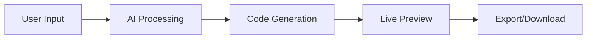

# 🎨 CodeCraft AI

> *Where imagination meets code. Describe it, and watch it come to life.*

[](https://reactjs.org/)
[](https://vitejs.dev/)
[](https://ai.google.dev/)
[](https://tailwindcss.com/)

## ✨ What is CodeCraft AI?

CodeCraft AI is your creative coding companion that transforms your ideas into beautiful, responsive UI components in seconds. Simply describe what you want, choose your framework, and watch the magic happen!

```
💭 "Create a modern login form with glassmorphism design"
    ↓
🤖 AI Processing...
    ↓
💻 Beautiful, production-ready code!
```

## 🚀 Features

- **🎯 AI-Powered Generation** - Powered by Google's Gemini AI for intelligent code creation
- **🎨 Multi-Framework Support** - HTML+CSS, Tailwind, Bootstrap, and JavaScript combinations
- **🌓 Dark/Light Theme** - Beautiful themes that adapt to your preference
- **📱 Responsive Design** - Mobile-first approach for all generated components
- **⚡ Live Preview** - See your component in action instantly
- **💾 Export Options** - Copy to clipboard or download as HTML file
- **🔒 Rate Limiting** - Built-in protection against API abuse
- **✨ Modern UI** - Clean, animated interface with smooth transitions

## 🎮 Quick Start

1. **Clone & Install**
   ```bash
   git clone https://github.com/your-username/codecraft-ai.git
   cd codecraft-ai
   npm install
   ```

2. **Setup Environment**
   ```bash
   # Create .env file
   echo "VITE_GOOGLE_API_KEY=your_gemini_api_key_here" > .env
   ```

3. **Launch**
   ```bash
   npm run dev
   ```

4. **Create Magic** ✨
   - Open `http://localhost:5173`
   - Describe your dream component
   - Watch it materialize!

## 🛠️ Tech Stack

| Technology | Purpose | Why We Chose It |
|------------|---------|-----------------|
| **React 19** | Frontend Framework | Latest features, excellent performance |
| **Vite** | Build Tool | Lightning-fast development experience |
| **Tailwind CSS** | Styling | Utility-first, highly customizable |
| **Google Gemini AI** | Code Generation | State-of-the-art language model |
| **Monaco Editor** | Code Editor | VS Code experience in the browser |
| **React Router** | Navigation | Seamless page transitions |

## 🎯 How It Works



1. **Describe** your component in natural language
2. **Select** your preferred framework
3. **Generate** with AI-powered intelligence
4. **Preview** in real-time
5. **Export** your creation

## 📸 Screenshots

### Dark Theme
```
🌙 Sleek dark interface perfect for late-night coding sessions
```

### Light Theme
```
☀️ Clean light theme for bright, productive mornings
```

## 🌟 Example Generations

**Input:** *"Create a pricing card with gradient background and hover effects"*

**Output:** Beautiful, animated pricing component with:
- Gradient backgrounds
- Smooth hover transitions
- Responsive design
- Modern typography


[⭐ Star this repo](https://github.com/your-username/codecraft-ai) • [🐛 Report Bug](https://github.com/your-username/codecraft-ai/issues) • [💡 Request Feature](https://github.com/your-username/codecraft-ai/issues)

</div>
